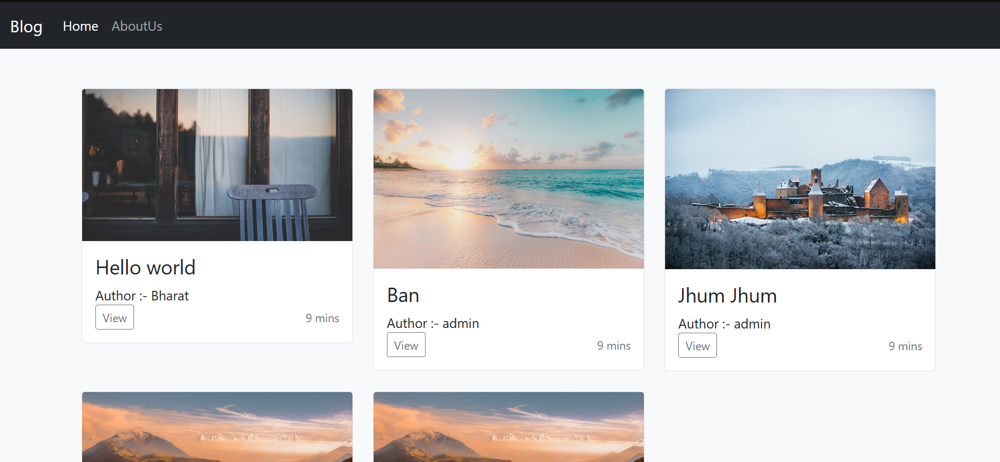
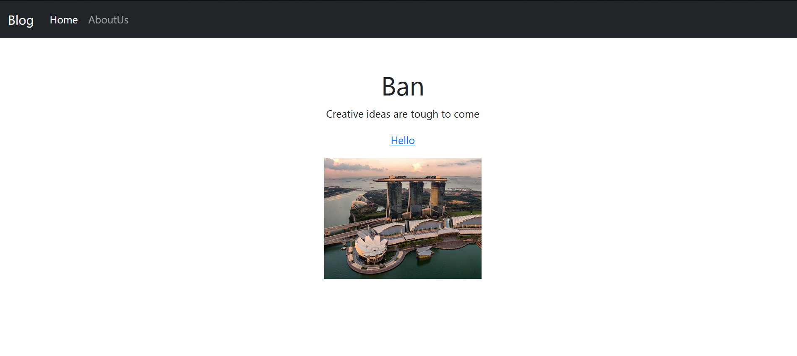
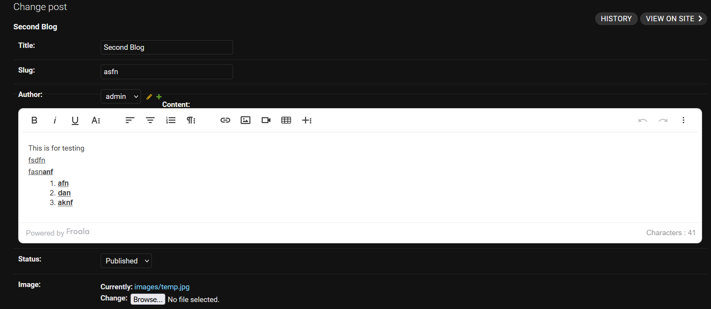

# Blog_Django    

This Blog is a simple Project using the available django models and admin interface with the help of the froala editor

<b>The Secret_Key required for the execution and debugging of project is not removed from the project code. So you can use the project as your college mini-project or by using the project code you can build your own project.</b>

<h2>Technologies Used:</h2>
<ul>
    <li>Python</li>
    <li>Django</li>
    <li>Bootstrap</li>
    <li>Heroku</li>
</ul>
<h2>Additional Python Modules Required:</h2>
<ul>
    <li>Django</li>
    <li>django-froala-editor</li>
    <li>Pillow</li>
    <li>Gunicorn</li>
    <li>Whitenoise</li>
</ul>

<h2>Usage :</h2>

    python Blog_Django/manage.py makemigrations

    python Blog_Django/manage.py migrate

    python Blog_Django/manage.py runserver
    
   In your web browser enter the address : http://localhost:8000 or http://127.0.0.1:8000/
   
   # ScreenShots :
   This is our home page shows us the list of blogs which have been published. 
   
    
   This is the individual page of the same blog.
   
    
   As we can see below froala editor give us the flexibility of editing of our text  
   Like alignment, bold, underline or we can embed some links and images also.
    
   
   
